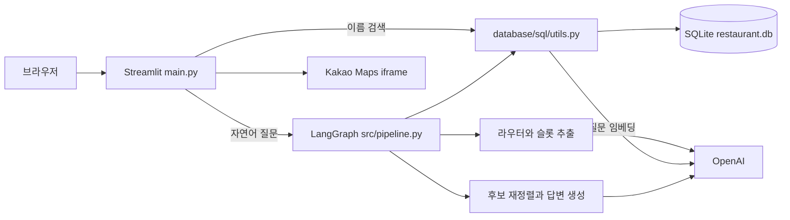

# 시스템 아키텍처

[문서 목록](../README.md)

## 구성

## 책임 경계

| 구성 | 책임 | 근거 |
| --- | --- | --- |
| 화면 | 입력·결과 카드·상세·지도·스트리밍 표시 | [main.py](../../main.py) |
| 그래프 | 경로 결정부터 검색·생성까지 상태 전달 | [pipeline.py](../../src/pipeline.py) |
| 검색 | SQL·임베딩 후보 조회, 관계 테이블 이동, 상세 조인 | [utils.py](../../database/sql/utils.py) |
| 재정렬 | 질문 토큰과 후보의 부분 문자열 매칭 | [retriever.py](../../src/retriever.py) |
| 생성 | 후보·프롬프트·대화 이력으로 모델 호출 | [generator.py](../../src/generator.py) |
| 수집·적재 | HTML→CSV→스키마·임베딩 준비 | [database](../../database) |

화면과 질의 처리는 같은 Python 프로세스에서 실행됩니다. REST 서버·작업 큐·별도 벡터 DB는 없습니다. SQLite의 임베딩을 읽어 애플리케이션 메모리에서 코사인 유사도를 계산합니다.

## 상태와 외부 의존성

- 컴파일된 그래프는 최초 생성 후 전역 `_graph`로 재사용합니다.
- 대화 이력은 `session_id`를 키로 하는 전역 사전에 보관합니다. 영속 저장·만료·사용자 인증과의 연결은 없습니다.
- 웹은 `call_agent`의 기본 `test_session`을 사용하므로 브라우저 세션별 대화 격리를 제공하지 않습니다.
- 모델에 전달되는 데이터에는 질문·이전 대화·후보 식당의 메뉴/리뷰가 포함됩니다.
- 지도 키가 없으면 안내를 렌더링하지만, DB 검색 모듈의 OpenAI 클라이언트는 앱 import 때 초기화됩니다.

운영 제약은 [배포 문서](../09-deployment/deployment.md)에 정리합니다.
