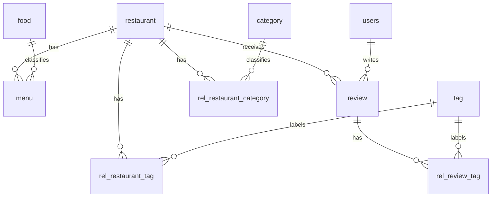

# 데이터 스키마와 관계

[문서 목록](../README.md)

## 기준 자료

스키마 근거는 [db_setup.ipynb](../../database/sql/db_setup.ipynb), 실제 읽는 컬럼은 [utils.py](../../database/sql/utils.py)입니다. 런타임 DB 경로는 `database/sql/restaurant.db`이며 현재 체크아웃에는 없습니다.

## 테이블

| 테이블 | 주요 컬럼·관계 |
| --- | --- |
| `restaurant` | PK `restaurant_code`; name, img_link, region, address, lat, lng, open_time, close_time, tel_no |
| `users` | PK `user_code`; name, avg_score, review_cnt, follower_cnt |
| `food` | PK `food_code`; name, description, embedding |
| `menu` | PK `menu_code`; FK restaurant_code/food_code; name, price, description, prompted_description, embedding |
| `review` | PK `review_code`; FK restaurant_code/user_code; score, taste_level, price_level, service_level, content, menu, embedding |
| `category` | PK category_code; name, description, embedding |
| `tag` | PK tag_code; name, description, embedding |
| `rel_restaurant_category` | 복합 PK restaurant_code/category_code |
| `rel_restaurant_tag` | 복합 PK restaurant_code/tag_code |
| `rel_review_tag` | 복합 PK review_code/tag_code |

DDL에 FK 선언이 있어도 런타임 연결에서 FK 강제 설정을 별도로 보장하지 않으므로 적재 후 참조 무결성을 점검해야 합니다.

## 저장된 CSV 규모

아래는 [db_csv_tablewise](../../database/processed/db_csv_tablewise)의 헤더를 제외한 실측 행 수입니다. DB 행 수나 고유 엔티티 검증 결과가 아닙니다.

| 파일 | 행 수 | DB와의 차이 |
| --- | ---: | --- |
| restaurant.csv | 100 | 좌표·영업시간 포함 |
| menu.csv | 2,008 | food_code·설명 보강·임베딩 추가 필요 |
| review.csv | 422 | 임베딩 추가 필요 |
| user.csv | 171 | users 테이블, rv_cnt→review_cnt |
| category.csv | 123 | category_name→name, 설명·임베딩 추가 |
| tag.csv | 143 | 설명·임베딩 추가 |
| rel_res_cat.csv | 176 | rel_restaurant_category로 적재 |
| rel_res_tag.csv | 625 | rel_restaurant_tag로 적재 |
| rel_rev_tag.csv | 2,336 | rel_review_tag로 적재 |

`food`의 완성 CSV와 최종 DB 전체는 포함되어 있지 않으므로 기존 문서의 food 행 수를 현재 데이터 실측치로 유지하지 않습니다.

## 임베딩과 검색용 객체

`category`, `food`, `menu`, `tag`, `review`의 `embedding`은 base64로 인코딩한 float32 벡터를 TEXT로 저장합니다. 코드가 복호화 가능한 벡터를 모아 코사인 유사도를 계산하므로 차원과 생성 모델의 일치가 필요합니다.

`get_detailed_restaurants`는 식당 필드에 `category`, `tags`, `menus`, `reviews` 배열을 붙여 반환합니다. 이 객체를 모델 문맥과 UI가 함께 사용합니다. 모델용 객체에 검색에 필요 없는 데이터가 추가될 때는 전송 범위와 문맥 크기도 함께 검토해야 합니다.
